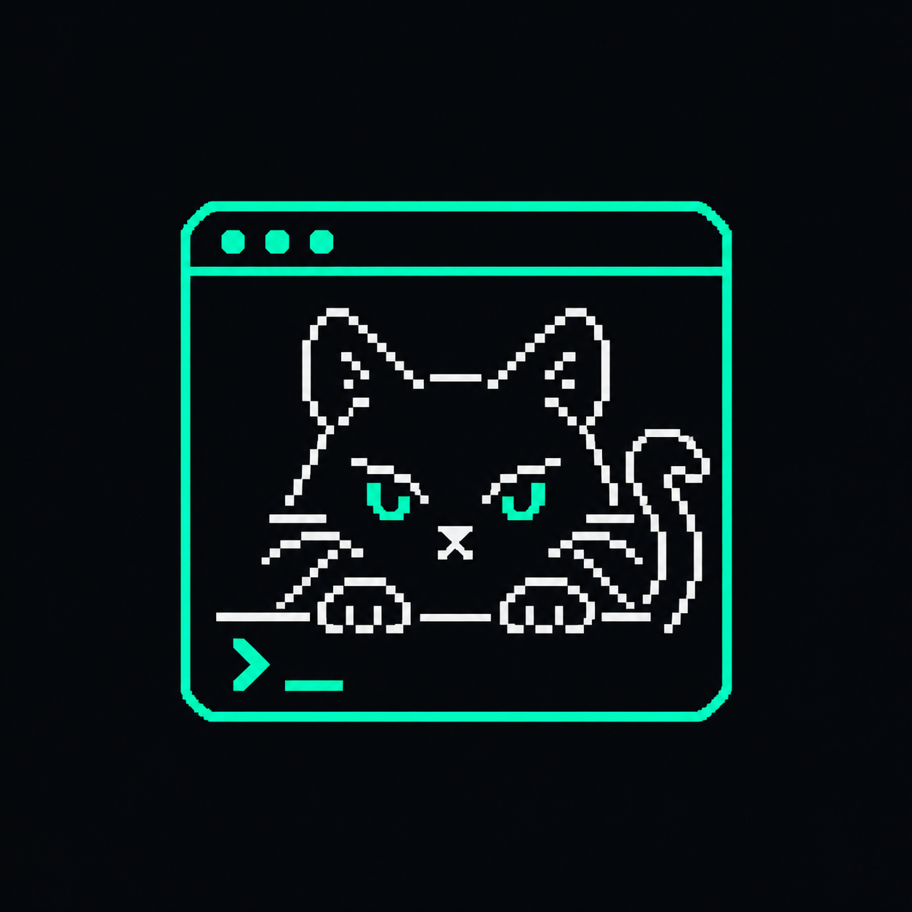

# 🤖 KURO 2.0 — Autonomous Terminal AI System Assistant

<div align="center">
  
  <h3>Level 2 Autonomous System Engineer & Terminal Assistant</h3>
  <p><b>Context Engine</b> | <b>Typed Memory</b> | <b>Verification Loop</b> | <b>Permission Gate</b> | <b>Plugin Registry</b> | <b>Encrypted Vault</b> | <b>AST Sandbox Guard</b></p>
</div>

---

## 🌟 Overview

**KURO 2.0** is an enterprise-grade autonomous AI desktop and CLI agent built in Python. Designed as a long-term scalable assistant, Kuro operates locally on your machine while providing safe self-improvement, project awareness, structured task planning, multi-provider LLM failover, encrypted credential management, AST execution sandboxing, and modular plugin extensibility.

---

## 🚀 Key Architectural Systems

### 1. 🔒 Encrypted Secret Vault (`/vault`)
- Replaces / augments plaintext `.env` storage with **Windows DPAPI** (`CryptProtectData`/`CryptUnprotectData`) and **AES-256 / PBKDF2** encrypted credential storage (`vault.enc`).
- Provides zero-dependency native Windows encryption tied to your OS user profile.
- In-memory credential masking and auto-migration from existing `.env` files via `/vault migrate`.
- Supports explicit master password locking (`/vault lock`) and unlocking (`/vault unlock`).

### 2. 🛡️ AST Code Safety Sandbox & Execution Guard (`/sandbox`)
- Pre-execution AST (Abstract Syntax Tree) analyzer that inspects all dynamic Python execution requests before runtime.
- Proactively blocks malicious or catastrophic operations (e.g. recursive disk formatting, dangerous `_ctypes` memory manipulations, destructive shell patterns).
- Dedicated isolated workspace directory `%APPDATA%\Kuro\sandbox\` for temporary scripts and artifact generation.
- **Privacy & PII Sanitizer:** Automatically masks API keys, bearer tokens, passwords, and sensitive strings from logs and outputs.

### 3. 🧠 Context Engine
- Selectively retrieves relevant working memory, recent episodic exchanges, semantic facts, and procedural skills within a strict token budget.
- Eliminates context-window overflow by prioritizing essential data over full conversation history.

### 4. 🗄️ Structured Memory System
- **Episodic Memory:** Chronological interaction log and conversation summaries.
- **Semantic Memory:** Key-value knowledge graph storing project facts, tech stacks, and user preferences.
- **Procedural Memory:** Structured skills with workflows, preconditions, versioning, and success rates.
- **Working Memory:** Real-time state of current goal, active step, and tool observations.

### 5. 🔍 Verification & Reflection Loop
- Evolves execution from `Think → Act → Observe` into `Think → Plan → Act → Observe → Verify → Reflect`.
- Targeted verification strategies for file existence, Python syntax compilation (`py_compile`), JSON syntax, shell return codes, web fetch word counts, and SQL execution.
- Classifies outcomes as `SUCCESS`, `PARTIAL_SUCCESS`, `FAILURE`, or `UNKNOWN`.

### 6. 🛡️ Centralized Permission & Security Layer
- Enforces strict risk categorization:
  - **`SAFE`**: Read-only actions (read file, list directory, search web, fetch URL).
  - **`CONFIRM`**: Impactful operations (write file, edit file, run command, execute python, save skill).
  - **`DANGEROUS`**: Destructive actions (delete files, modify system config, self-modify, credential access).
- Safe Mode prompts for user confirmation before executing any `CONFIRM` or `DANGEROUS` action.

### 7. ⚙️ Task State Machine
- Lifecycle state transitions:
  `PENDING → PLANNING → EXECUTING → VERIFYING → COMPLETED`
  *(Failure path: `EXECUTING → FAILED → RECOVERING → RETRY → VERIFYING`)*
- SQLite-backed state persistence for cross-session task recovery.

### 8. 🔌 Modular Plugin Architecture
- Standardized `ToolContract` with input/output schemas, risk levels, and versioning.
- Dynamic plugin discovery from `%APPDATA%\Kuro\plugins\`.
- Clean separation between core agent runtime and user interfaces.

### 9. 📁 Project Awareness Engine
- Automatic inspection of root directory to build a project profile: programming languages, frameworks, package managers, entry points, configuration files, build/test scripts, and Git status.
- Profiles cached in `%APPDATA%\Kuro\projects\` for fast lookup.

### 10. 🎯 Task-Aware Model Router & Metrics
- Task classification: `FAST_SIMPLE`, `COMPLEX_REASONING`, `CODING`, `VISION`.
- Routes to optimal models while preserving multi-provider (`Gemini`, `Groq`, `OpenRouter`, `OpenAI`, `Ollama`) and multi-key failover rotation.
- Tracks execution metrics: token usage, tool calls, retries, duration, and verification results.

### 11. 🌐 Connected Services & Multi-Channel Notifier
- External integrations (`integrations/`): **GitHub**, **Google Drive**, and **Email (SMTP/IMAP)**.
- Multi-channel notification center (`/notify`): Windows Toast, Discord Webhooks, Telegram Bot, Slack Webhooks, and Voice Audio Chimes.

---

## 📂 Repository Structure

```text
Kuro/
├── main.py                     # CLI REPL & Entry Point (prompt_toolkit + Typer)
├── prompt.txt                  # Evolution Requirements Specification
├── README.md                   # Project Documentation
├── requirements.txt            # Python Dependencies
│
├── core/                       # Kuro Core Agent Engine
│   ├── agent.py                # KuroAgent ReAct Autonomous Loop
│   ├── vault.py                # Encrypted Credential Vault (Windows DPAPI / AES-256)
│   ├── sandbox.py              # AST Execution Guard & Privacy PII Sanitizer
│   ├── paths.py                # Centralized Path Manager (AppData vs AppDir)
│   ├── permissions.py          # Centralized Permission Gate (SAFE/CONFIRM/DANGEROUS)
│   ├── task_state.py           # Task Lifecycle State Machine & Registry
│   ├── memory_types.py         # Episodic, Semantic, Procedural & Working Memory
│   ├── context_engine.py       # Context Retrieval Engine & Token Budgeter
│   ├── verification.py         # Verification Strategy Engine
│   ├── skill_system.py         # Skill Discovery, Relevance Matching & Creation
│   ├── plugin_registry.py      # ToolContract & Dynamic Plugin Loader
│   ├── project_aware.py        # Project Profile Inspector & Cacher
│   ├── model_router.py         # Task-Aware Model Router & Execution Metrics
│   ├── self_update.py          # Safe Self-Improvement Staged Pipeline
│   ├── experiment.py           # Multi-Candidate Experiment System
│   ├── multi_agent.py          # Specialized Agent & Orchestrator Abstractions
│   ├── integration_manager.py  # External Integrations Manager
│   ├── logger.py               # Secret-Redacting Structured Logger
│   ├── config.py               # KeyPools, Fallback Chains, & Env Settings
│   ├── llm.py                  # Multi-Provider Failover REST Dispatcher
│   ├── memory.py               # Memory JSON/SQLite bridge
│   ├── memory_db.py            # Persistent SQLite Database Storage (kuro.db)
│   └── personality.py          # Personality Profile Loader
│
├── tools/                      # Built-in Autonomous Action Tools
│   ├── files.py                # File read/write/edit with diffs & SQL queries
│   ├── system.py               # Shell command execution & security checks
│   ├── planner.py              # Task plan generator & step formatter
│   ├── web.py                  # Web search & URL content fetcher
│   ├── web_browser.py          # Headless browser & Playwright automation
│   ├── git_checkpoint.py       # Git auto-checkpoints & one-command rollback
│   ├── voice.py                # Edge-TTS Neural Voice & microphone input
│   ├── vision.py               # Base64 multimodal image analysis
│   ├── interpreter.py          # Embedded Python code execution (AST-guarded)
│   ├── notifier.py             # Multi-channel notification engine
│   ├── hotkey.py               # Win32 global hotkey listener (Ctrl+Alt+K)
│   ├── db_explorer.py          # SQLite database schema explorer
│   └── self_improve.py         # Custom routines persistence
│
├── integrations/               # External Service Integrations
│   ├── base.py                 # Abstract Base Integration Contract
│   ├── github_integration.py   # GitHub API Integration (Repos, Issues, PRs)
│   ├── google_drive_integration.py # Google Drive Integration
│   └── email_integration.py    # Email SMTP/IMAP Integration
│
├── build/                      # Production Build & EXE Architecture
│   ├── build_exe.py            # PyInstaller PyInstaller --onedir Build Script
│   ├── setup_installer.iss     # Inno Setup Installer Script
│   └── KURO.spec               # PyInstaller Build Specification
│
├── tests/                      # Verification & Test Suites
│   ├── test_all.py             # Master core regression test suite
│   ├── test_evolution.py       # Architecture evolution module test suite
│   └── test_full_system.py     # End-to-end full system & security test suite
│
└── assets/                     # Media & Graphics
    ├── kuro_icon.png           # Application Logo (PNG)
    └── kuro_icon.ico           # Executable Icon (ICO)
```

---

## ⚡ Categorized Command Reference

| Command | Purpose | Example / Usage |
| :--- | :--- | :--- |
| **⚙️ Core & Configuration** | | |
| `/status` | Active provider, model, & safe mode status | Type `/status` |
| `/safe` | Toggle Safe Mode & permission prompts | `/safe off` \| `/safe allow execute_python` |
| `/pool` | View API key pool & cooldown status | Type `/pool` |
| `/models` | View model fallback priority chain | Type `/models` |
| `/key` | Add API key to key pool | `/key <KEY>` or `/key groq <KEY>` |
| `/undo` | Rollback file changes via Git | Type `/undo` |
| `/hotkey` | Global Win32 Hotkey Status (Ctrl+Alt+K) | Type `/hotkey` |
| `!<cmd>` | Direct shell execution bypass | `!dir` or `!git status` |
| **🔒 Security & Privacy** | | |
| `/vault` | Encrypted credential vault manager | `/vault list` \| `/vault set <KEY> <VAL>` |
| `/sandbox` | AST code safety analyzer & execution guard | `/sandbox status` \| `/sandbox toggle` |
| **📁 Workspace & Project** | | |
| `/dir` | List directory contents (with path Tab autocompletion) | `/dir core/` |
| `/project` | Show current project profile & tech stack | Type `/project` |
| `/notes` | Write structured Markdown note to brain/notes/ | `/notes test.md content` |
| `/db` | Explore SQLite database schema, tables, and rows | `/db brain/kuro.db` |
| `/sql` | Execute raw SQL query on database | `/sql SELECT * FROM tasks;` |
| **🧠 Memory & Tasks** | | |
| `/memory` | Persistent conversation memory & brain summary | Type `/memory` |
| `/clear` | Reset active conversation memory | Type `/clear` |
| `/plan` | Task planning mode (goal decomposition) | `/plan build a trading bot` |
| `/tasks` | List active/historical task states | Type `/tasks` |
| `/metrics` | View execution analytics (tokens, tool calls, costs) | Type `/metrics` |
| **🛠️ Tools & Perception** | | |
| `/search` | Live web search (DuckDuckGo + Wikipedia) | `/search OpenAI news 2026` |
| `/see` | Multimodal Vision & Image Analysis | `/see assets/kuro_icon.png` |
| `/browse` | Headless web browser automation & scraping | `/browse https://news.ycombinator.com` |
| `/voice` | Neural TTS output (toggle/list/switch speaker) | `/voice list` or `/voice andrew` |
| `/listen` | Microphone Speech-to-Text input mode | Type `/listen` |
| `/notify` | Smart notifications (Toast, Discord, Telegram, Slack) | `/notify --channel telegram --target @channel "Alert"` |
| **🌐 Integrations & Skills** | | |
| `/integrations`| Manage connected services (GitHub, Drive, Email, Telegram, Discord) | Type `/integrations` |
| `/connect` | Connect service token & persist to Vault/.env | `/connect telegram <BOT_TOKEN> [CHAT_ID_OR_CHANNEL]` |
| `/disconnect` | Disconnect external service integration | `/disconnect telegram` |
| `/learn` | Save custom procedural routine | `/learn test_flow Run tests` |
| `/skills` | List all self-learned skills | Type `/skills` |
| **🚪 Session** | | |
| `/help` | Show categorized command reference | Type `/help` |
| `exit / quit` | Terminate active KURO session | `exit` or `quit` |

---

### 📱 Telegram Channel Messaging Guide

Why Telegram channel messages sometimes fail and how Kuro 2.0 solves it:

1. **Bot Must Be An Administrator**:
   To send messages to a public or private Telegram Channel, your bot **must be added as an Administrator** in Channel Settings with the **"Post Messages"** permission enabled.
2. **Chat ID Formatting**:
   - **Public Channels**: Use `@your_channel_username` or `-100xxxxxxxxxx`.
   - **Private Channels / Supergroups**: Use the numeric ID `-100xxxxxxxxxx` (obtainable by forwarding a channel post to `@userinfobot` or `@JsonDumpBot`).
   - **Direct User Messages**: Send `/start` to your bot in Telegram first, then use your numeric user ID.
3. **HTML Parse Mode**:
   Kuro 2.0 uses HTML parsing with automatic entity escaping and plain text fallbacks, eliminating Telegram entity parsing errors on underscores and backticks.
4. **Diagnostic Commands**:
   - Run `/notify diagnose telegram [@channel_or_id]` to automatically check channel connectivity, permissions, and bot status.
   - Run `/notify test telegram` to send a verified test card.

---

## 🧪 Testing & Verification

Run the comprehensive test suites to verify system integrity:
```bash
# Core regression tests (12/12)
python tests/test_all.py

# Architecture evolution tests (11/11)
python tests/test_evolution.py

# End-to-end full system, Security Vault & Integrations tests (17/17)
python -m unittest tests/test_full_system.py
```
*Total: 40 / 40 test cases passing.*
