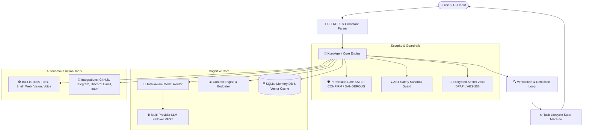

<div align="center">


# 🤖 KURO 2.0 — Autonomous Terminal AI Agent Engine

### *Level 2 Autonomous System Engineer & Intelligence Desktop Assistant*

[](https://www.python.org/)
[](LICENSE)
[](tests/test_all.py)
[](core/vault.py)
[](core/agent.py)

---

**Context Engine** • **Typed SQLite Memory** • **Verification Loop** • **Permission Gate** • **AST Sandbox Guard** • **Encrypted Vault** • **Multi-Model Failover**

</div>

---

## 🌟 Overview

**KURO 2.0** is an enterprise-grade autonomous AI system assistant and CLI agent built in Python. Engineered for long-term scalability and security, Kuro operates locally on your system while providing multi-provider LLM failover, encrypted credential vaulting, AST code safety execution sandboxing, structured multi-layered memory, and modular external service integrations.

> [!NOTE]
> **Zero-State Ready**: KURO 2.0 initializes cleanly with zero pre-existing user data. Databases, secret vaults, and project profiles are dynamically initialized on first run.

---

## 🏗️ Architecture Overview



---

## 🚀 Key Features & Capabilities

### 🔐 Encrypted Secret Vault (`/vault`)
- Native **Windows DPAPI** (`CryptProtectData`/`CryptUnprotectData`) & **AES-256 / PBKDF2** encryption for sensitive credentials.
- Zero-dependency profile-tied encryption for API keys, bot tokens, and database passwords.
- In-memory credential masking and seamless migration from `.env` files via `/vault migrate`.

### 🛡️ AST Code Safety Sandbox & Execution Guard (`/sandbox`)
- Pre-execution Abstract Syntax Tree (AST) analyzer inspects dynamic Python execution requests before runtime.
- Proactively blocks malicious disk formatting, raw memory manipulations, and destructive shell execution patterns.
- Automatic PII & API secret sanitizer redacting keys and passwords from logs and terminal outputs.

### 🧠 Context Engine & Typed Memory Architecture
- **Episodic Memory**: Chronological interaction history and automated thread summarization.
- **Semantic Memory**: Key-value knowledge graph storing technical stacks, project specs, and user preferences.
- **Procedural Memory**: Custom executable routines and reusable skills.
- **Working Memory**: Real-time token budget manager keeping active context minimal and fast.

### 🔍 Verification & Reflection Loop
- Enhances standard `Think → Act → Observe` into `Think → Plan → Act → Observe → Verify → Reflect`.
- Automated strategy verification for file edits, Python syntax compilation, JSON integrity, shell return codes, and SQL queries.

### 🎯 Task-Aware Model Router
- Dynamic task classification (`FAST_SIMPLE`, `COMPLEX_REASONING`, `CODING`, `VISION`).
- Multi-provider failover support across **Gemini**, **Groq**, **OpenRouter**, **OpenAI**, and local **Ollama** models.

---

## ⚡ Quick Start

### 1. Prerequisite Requirements
- **Python 3.10+** (Python 3.11 or 3.12 recommended)
- **Git**

### 2. Installation

```bash
# Clone repository
git clone https://github.com/Abdo-omran2206/KuroAgent.git
cd KuroAgent

# Install required dependencies
pip install -r requirements.txt
```

### 3. Configuration

Create a `.env` file or initialize your secure vault:

```bash
# Copy template environment file
cp .env.example .env
```

Set your preferred API keys in `.env` (e.g. `GEMINI_API_KEY`, `GROQ_API_KEY`, `OPENAI_API_KEY`), or store them securely in the encrypted vault after launching Kuro:

```text
/vault set GEMINI_API_KEY your_api_key_here
```

### 4. Launch KURO

```bash
python main.py
```

---

## 📁 Repository Structure

```text
KuroAgent/
├── main.py                     # CLI REPL Entry Point (prompt_toolkit + Rich + Typer)
├── README.md                   # System Documentation
├── requirements.txt            # Python Package Dependencies
├── .env.example                # Template Environment Secrets Configuration
├── .gitignore                  # Git Exclusion Rules (Ignores Database & Vaults)
│
├── core/                       # Core Agent Architecture Package
│   ├── agent.py                # KuroAgent ReAct Core Execution Loop
│   ├── vault.py                # Encrypted Credential Vault (DPAPI / AES-256)
│   ├── sandbox.py              # AST Execution Guard & Privacy PII Redactor
│   ├── paths.py                # Centralized Directory & Application Path Manager
│   ├── permissions.py          # Permission Gate (SAFE / CONFIRM / DANGEROUS)
│   ├── task_state.py           # Task Lifecycle State Machine & State Registry
│   ├── memory_types.py         # Episodic, Semantic, Procedural & Working Memory Data Models
│   ├── context_engine.py       # Context Engine & Token Budget Optimization
│   ├── verification.py         # Automated Verification & Reflection Engine
│   ├── skill_system.py         # Reusable Skill Discovery & Storage
│   ├── plugin_registry.py      # ToolContract Schemas & Plugin Loader
│   ├── project_aware.py        # Project Profile Inspector & Technology Detector
│   ├── model_router.py         # Model Router & Multi-Provider Metrics
│   ├── self_update.py          # Safe Self-Improvement & Hot Reloading Pipeline
│   ├── experiment.py           # Multi-Candidate System Experimentation
│   ├── multi_agent.py          # Agent & Sub-Agent Orchestrator Abstractions
│   ├── integration_manager.py  # Service Integrations Manager
│   ├── logger.py               # Secret-Redacting Structured Logger
│   ├── config.py               # KeyPools, Fallback Chains & Dynamic Settings
│   ├── llm.py                  # REST Multi-Provider Failover Dispatcher
│   ├── memory.py               # Memory Bridge Layer
│   ├── memory_db.py            # SQLite Persistent Database Engine (kuro.db)
│   └── personality.py          # System Personality Profile Engine
│
├── tools/                      # Built-in Toolset Modules
│   ├── files.py                # Smart File Reader, Writer, Diff Editor & SQL Tools
│   ├── system.py               # Guarded Shell Command Execution Engine
│   ├── planner.py              # Step-by-Step Task Decomposition & Formatter
│   ├── web.py                  # Live Web Search (DuckDuckGo + Wikipedia) & Page Fetcher
│   ├── web_browser.py          # Headless Playwright Browser Automation & Scraper
│   ├── git_checkpoint.py       # Git Auto-Checkpointing & Instant Rollback
│   ├── voice.py                # Edge-TTS Neural Voice Synthesizer & Speech Input
│   ├── vision.py               # Multimodal Image Analysis Engine
│   ├── interpreter.py          # Embedded Python Code Execution Engine
│   ├── notifier.py             # Multi-Channel Toast, Discord, Telegram, & Slack Notifier
│   ├── hotkey.py               # Global Win32 System Hotkey Listener (Ctrl+Alt+K)
│   ├── db_explorer.py          # SQLite Schema & Table Data Inspector
│   └── self_improve.py         # Custom System Skill Routines Manager
│
├── integrations/               # External Service Integrations
│   ├── base.py                 # Abstract Base Integration Contract
│   ├── github_integration.py   # GitHub REST API Integration
│   ├── google_drive_integration.py # Google Drive Integration
│   └── email_integration.py    # Email SMTP / IMAP Integration
│
├── build/                      # Build & Packaging Specifications
│   ├── build_exe.py            # Standalone Executable Build Script
│   ├── setup_installer.iss     # Inno Setup Windows Installer Script
│   └── KURO.spec               # PyInstaller Bundling Specification
│
├── tests/                      # Automated Verification & Test Suites
│   ├── test_all.py             # Core Master Unit & Regression Test Suite
│   ├── test_evolution.py       # Evolution & Architecture Test Suite
│   └── test_full_system.py     # End-to-End System & Security Test Suite
│
└── assets/                     # Graphics & Media Assets
    ├── kuro_icon.png           # Application Branding Logo (PNG)
    └── kuro_icon.ico           # Application Executable Icon (ICO)
```

---

## ⚡ Categorized Command Reference

| Category | Command | Description & Usage Example |
| :--- | :--- | :--- |
| **⚙️ System & Core** | `/status` | Display active provider, model status, and safe mode state |
| | `/safe` | Toggle Safe Mode (`/safe off` or `/safe allow execute_python`) |
| | `/pool` | View active API key pool and rate-limit cooldown status |
| | `/models` | View model routing priority chain and fallback providers |
| | `/key` | Add an API key (`/key <KEY>` or `/key groq <KEY>`) |
| | `/undo` | Rollback file modifications to previous Git checkpoint |
| | `/hotkey` | View Win32 system hotkey status (`Ctrl+Alt+K`) |
| | `!<cmd>` | Direct shell execution bypass (`!git status` or `!dir`) |
| **🔒 Security & Vault** | `/vault` | Manage DPAPI encrypted credential vault (`/vault list`, `/vault set KEY VAL`) |
| | `/sandbox` | AST safety guard control (`/sandbox status`, `/sandbox toggle`) |
| **📁 Project & Data** | `/dir` | List workspace files with tab autocompletion (`/dir core/`) |
| | `/project` | Inspect project stack profile and auto-detected tools |
| | `/notes` | Write structured Markdown note to `brain/notes/` |
| | `/db` | Explore SQLite database schema and tables (`/db brain/kuro.db`) |
| | `/sql` | Run SQL query on SQLite database (`/sql SELECT * FROM conversations;`) |
| **🧠 Memory & Tasks** | `/memory` | Inspect persistent memory graph and summarized facts |
| | `/clear` | Clear current working conversation history |
| | `/plan` | Generate step-by-step goal decomposition (`/plan build REST API`) |
| | `/tasks` | Inspect active and historical task execution state machine |
| | `/metrics` | Display execution analytics (tokens, retries, duration, costs) |
| **🛠️ Tools & Perception** | `/search` | Live web search (`/search latest Python 3.12 features`) |
| | `/see` | Multimodal vision & image analysis (`/see path/to/image.png`) |
| | `/browse` | Headless Playwright browser automation (`/browse https://news.ycombinator.com`) |
| | `/voice` | Neural TTS audio output control (`/voice list`, `/voice toggle`) |
| | `/listen` | Speech-to-Text microphone input mode |
| | `/notify` | Send multi-channel alert (`/notify --channel telegram --target @channel "Done"`) |
| **🌐 Integrations & Skills** | `/integrations` | Manage connected services (GitHub, Drive, Email, Telegram, Discord) |
| | `/connect` | Connect service token (`/connect telegram <BOT_TOKEN> [CHAT_ID]`) |
| | `/disconnect` | Disconnect integrated service (`/disconnect telegram`) |
| | `/learn` | Save learned procedural routine (`/learn build_flow Run build script`) |
| | `/skills` | List all saved procedural skills |
| **🚪 Session** | `/help` | Display interactive command reference menu |
| | `exit` / `quit` | Gracefully shut down active KURO session |

---

## 🧪 Testing & Quality Assurance

KURO 2.0 includes a comprehensive automated test framework ensuring regression safety and system reliability across all modules.

```bash
# Core master regression test suite (12/12 passing)
python tests/test_all.py

# Architecture evolution test suite (11/11 passing)
python tests/test_evolution.py

# Full end-to-end system & security integration tests (17/17 passing)
python -m unittest tests/test_full_system.py
```

> [!TIP]
> All 40 system test cases pass cleanly out-of-the-box on a fresh zero-state workspace.

---

## 📄 License

This project is open-source software licensed under the **[MIT License](LICENSE)**.

<div align="center">
  <sub>Built with ❤️ by Abdo Omran</sub>
</div>
